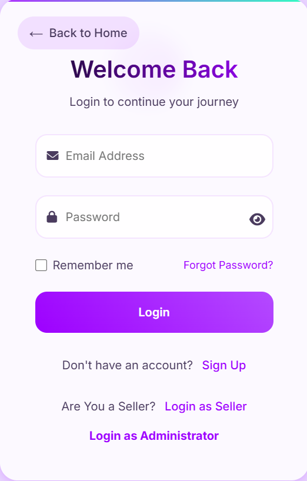
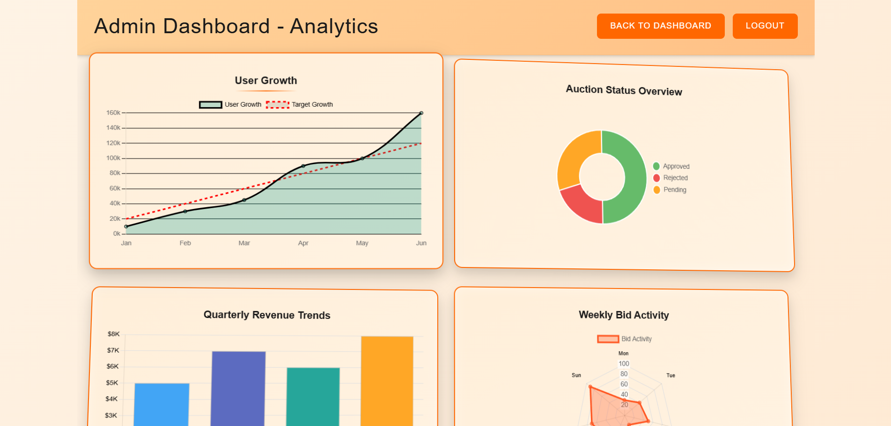

# BidNow – Real-Time Auction Platform

**BidNow** is a robust full-stack auction platform enabling real-time bidding, secure user authentication, and powerful admin analytics for seamless auction management.

---

## 🚀 Features

- 🔐 **Secure Login & Registration** with JWT authentication
- 📊 **Admin Dashboard** with real-time analytics and auction dispute resolution
- 🧑‍💻 **User Dashboard** showing active, won, and past auctions
- 📈 Handles **50+ concurrent users** per auction and **100+ active auctions**

---

## 🛠️ Tech Stack

- **Frontend**: Angular
- **Backend**: Node.js, Express.js
- **Database**: MongoDB
- **Authentication**: JWT
- **APIs**: REST

---

## 📸 Screenshots

| Feature              | Preview |
|----------------------|---------|
| **Home Page**        |  |
| **Login Page**       |  |
| **Register Page**    |  |
| **User Dashboard**   |  |
| **Admin Dashboard**  |  |
| **Analytics**        |  |

---

## 📈 Admin Analytics

- Track all running, pending, and completed auctions
- View real-time user engagement and bid metrics
- Resolve disputes with an integrated support interface

---

## 👤 Test Users

Supports login for **20+ test users** with role-based access (admin/user).

---

## 📬 Contact

Feel free to connect if you’d like to learn more or collaborate:

- 📧 jaimishra502@gmail.com  
- 💼 [LinkedIn](https://www.linkedin.com/in/JaiMishra25)  
- 🛠️ [GitHub](https://github.com/JaiMishra25)

---

> © 2025 Jai Mishra. All rights reserved.
